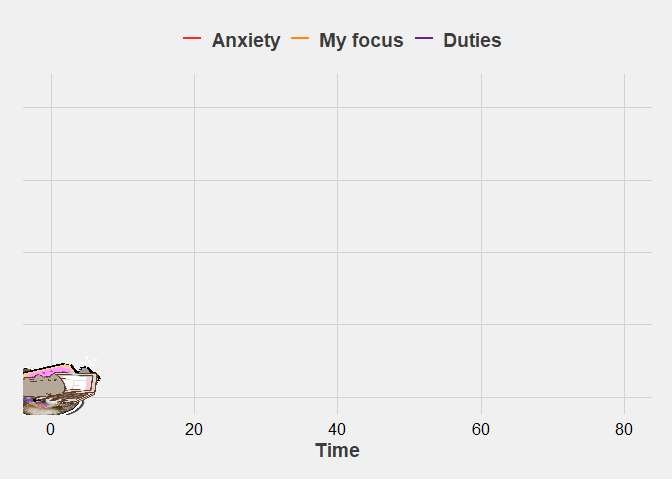

```{r,  eval=T, include=F}

#devtools::install_github("R-CoderDotCom/ggcats@main")
library(dplyr)
library(ggplot2)
library(ggthemes)
library(gganimate)
library(ggcats)


# A function to generate a data frame with simulated data and cats
data_cat <- function(from = 0, to = 80, by = 1, fun = rnorm, 
                     cat = "", sd = 3, category = "") {
  tibble(
    x = seq(from, to, by),
    y = fun(x) + rnorm(length(x), sd = sd),
    category = rep(category, length(x)),
    cat = rep(cat, length(x))
  )
}

# Data for my focus
concentration <- data_cat(
  fun = function(x) 4 * sin(1.5 * x) + 4, 
  cat = "lil_bub", 
  sd = 1, category = "focus"
  )

# Data for my duties
set.seed(10)

duties <- data_cat(
  fun = function(x) 5 + 1.5 * exp(x / 20), 
  cat = "pusheen_pc", 
  sd = 2, category = "duties"
  )

# Data for my anxiety
anxiety <- data_cat(
  fun = function(x) 10 + exp(x / 15) + 4 * sin(x), 
  cat = "nyancat", 
  sd = 1, category = "anxiety"
  )

# Complete data
full_data <- rbind(concentration, duties, anxiety)

cats<-ggplot(full_data, aes(x, y)) +
  geom_line(aes(color = category), size = 1) +
  geom_cat(aes(cat = cat), size = 4) +
  labs(
    y = element_blank(),
    x = "Time",
) +
  scale_color_manual(
    values = c("#EE2C2C", "#FF8C00", "#68228B"),
    labels = c("Anxiety", "My focus", "Duties")) +
  theme_fivethirtyeight() +
  theme(
    axis.text.y = element_blank(),
    axis.ticks.y = element_blank(),
    axis.text.x = element_text(size = 12, color = "black"),
    axis.title.x = element_text(size = 14, face = "bold"),
    legend.text = element_text(size = 14, face = "bold"),
    legend.position = "top",
    legend.title = element_blank()
  ) +
  transition_reveal(x)


anim_save("illustrations/cats.gif", cats)

# code from: https://rpubs.com/gunjan29/funnyplots
```


```{r, echo=FALSE, fig.align='center', out.width = '100%'}

```


