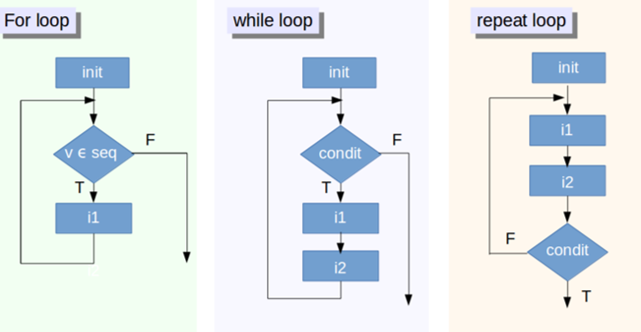
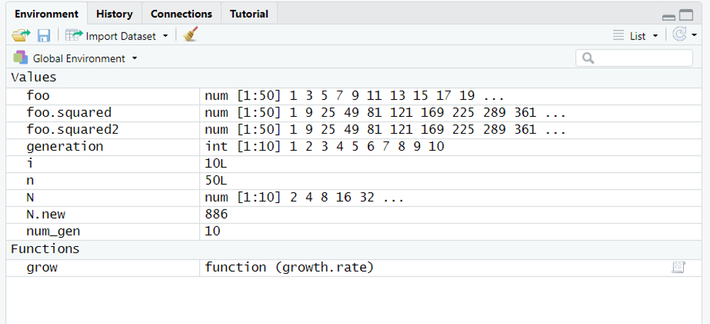
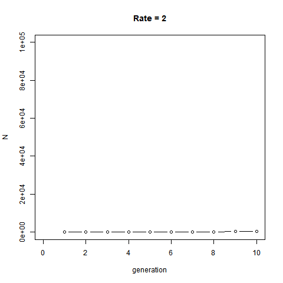
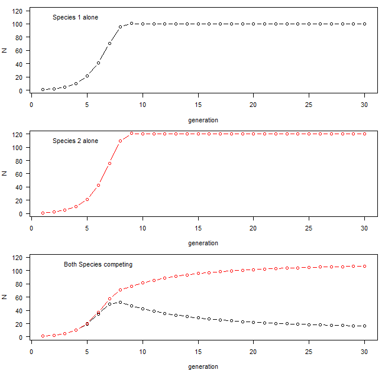

```{r eval = TRUE,  message=F, include=FALSE, warning=F, purl=F, results="hide"}
knitr::purl('functions.Rmd', documentation = 0)
```

```{r echo=FALSE, purl=F}
xfun::embed_file('functions.Rmd')
```

```{r echo=FALSE, purl=F}
xfun::embed_file('functions.R')
```

```{r echo=FALSE}
xaringanExtra::use_clipboard()
```

-----------------------

Today, we are going to speak about **loops** with an example of their use by creating our own **functions**: some simple demographic models. To make it funnier - but also because it illustrates very well what the purpose of a loop - we will visualize population dynamics using animation. Specifically, We will create GIFs using the package `animation`. The function `saveGIF` will only work if you have install [Image Magick](http://imagemagick.org) or [GraphicsMagick](http://www.graphicsmagick.org) on your computer. Install with **legacy utilities** (e.g. convert). Obviously the animation will not work if you skip this step. You may also experience other issues creating animated plots, but it is not the primary purpose of this class and you should now be able to troubleshoot :) 


```{r,  eval=T}
library(animation)
library(ggplot2)
library (gganimate)
```


# Loops

**What's that?** A loop is simply to repeat the same task a specific number of time. All loops (whatever their sizes) have always the same structure (architecture). As for an example a `for` loop is given as: 


<center>
`for` `(`counter `in` vector`){`task`}`
</center>


`for` loops are very common. It means **for** a given condition do something a number of time. This `for` can be replaced by `while` or `repeat`. Those are `while` and `repeat` loops. Check the figure below that illustrates those differences.




## Basics

A the job accomplished by a loop can simply be illustrated as below:

```{r,  eval=FALSE}
for(i in 1:100) {
print("Hello world!")
print(i*i)
}
```

`for(i in 1:100)` is our **counter**: `i` (but can be anything else, `i` is standard) will take the values 1, 2, 3, ..., and up to 100. Therefore the loop will repeat 100 times the element (**task**) that follows within the `{}`. 

In our loop, `i` will take the value 1 in the first loop "cycle". `i` will take the value 2 in the second loop "cycle", and so on until 100. Within the same cycle, it will also `print` `"Hello World"` follows by the result of the product `i*i` e.g. 1 for the first cycle (in order to illustrate the value taken by `i`). Here, it will be the same task for the next 99 remaining cycles of our loop. Got it? Let's now make it a more standard:

The "counter" is commonly set distinctly.  Check carefully, the syntax of a loop:

```{r,  eval=T}
demo <- seq (1,100,by=2) # sequence  1, 3, ..., 99
n<-length(demo) #  size of the foo sequence
demo.squared = NULL #  empty object

for (i in 1:n) { # our counter
  demo.squared[i] = demo[i]^2 # the task
}

demo.df<-data.frame(demo,demo.squared) 
plot (demo.df$demo~demo.df$demo.squared)

```

The sequence `demo.squared` received the square value of each individual element of the sequence `demo`. **Nice**, but totally  **useless**. The exact same operation can  be accomplished with the most concise writing: 

```{r,  eval=FALSE}
demo.squared2<-demo^2
plot (demo~demo.squared2)
```

As mentioned earlier and like we already saw in action, the functions in R are generally **vectorized**. It means when you applied them to a selected **vector**, they will apply to all the elements of this vector. It makes life easier that you don't need to say you want to apply something to the first element of this vector, then repeat the same for the second element, etc. (what we did in our loop). In addition, vectorized functions are way faster than making loops. Compare the time of the following with the time that you need to do the same using a loop. Make the sequence longer, such as up to 1,000,000.  

```{r,  eval=FALSE}
system.time(demo.squared2<-demo^2)
```

A vectorized function will usually consider a vector as a block and will apply this task to all elements at once. That's why it is way faster. So, why do we care about loops?

Simply saying, a loop have their use and interest in recycling an element you just created in a previous cycle. The next cycle will use the same task but it will "enrich" the element previously created, such as with adding number of recruits in a population at year 2.

## Recycling

Let's get this idea about population growth where the number of individuals at one generation (cycle *t*) will determine the population at the following generation (cycle *t+1*). Note that it is the equivalent of *t-1* and *t*. 

```{r,  eval=T, fig.align='center'}
num_gen<-10  # no. generation
generation<-1:num_gen # create a variable generation
N <- rep (0,num_gen) #  "vector" of 10 zeros (could be `NULL`)
lambda <- 2 # growth rate
N[1] <- 2 # We need to set initial pop size
for (t in 1:(num_gen - 1)) { # the counter
  N[t+1]=lambda*N[t]  # task: double individuals
   }
plot(N~generation, type='b', col='blue', main='Discrete exponential growth') # the plot
```


Congrats! You just wrote a demographic model called exponential growth. This is typically the type of model used to examine bacteria growth. 


**Exponential grwoth**

$$N_{t+1}= N_{t}+bN_{t}-dN_{t}$$
$$N_{t+1}= N_{t}+(b-d)N_{t}$$
$$N_{t+1}= N_{t}+rN_{t}$$
$$N_{t+1}= (1+r)N_{t}$$
$$N_{t+1}= \lambda N_{t}$$
Here $N_{t+1}$ is the new population, $N_t$  is the old population, $b$  is the per capita birth rate, $d$ is the per capita death rate, and $λ$ is the growth rate such that $\lambda =b−d+1$. In our model, the population doubles (growth rate = 2) at each generation (time). You can now play at increasing initial population size and manipulating growth rate. All the other loops will follow the same structure, just the task may be a 'little' bit more complicated. You can also add loop within loop, etc. 

More read on loops and why to avoid them in the free online class available [here](https://www.datacamp.com/community/tutorials/tutorial-on-loops-in-r)

# Function

We already used plenty of function so far, so let's now create ours. We create a **function** with an named object containing a `function`. You can specify within the **arguments** you wanna control. Let's illustrate it by wrapping our small demographic model into a function giving it more flexibility in customizing the growth rate of the population.

```{r,  eval=T} 
grow <- function (growth.rate) { # argument "growth.rate" of function "grow" 
num_gen<-10
generation<-1:num_gen
N <- rep (0,num_gen)
N[1] <- 1
for (t in 2:num_gen) { 
# not the use growth.rate argument and t-1  this time
  N[t]=growth.rate*N[t-1] 
}
  plot(N~generation,type='b', main=paste("Rate =", growth.rate)) 
}
```

It created a function called `grow` and now visible in RStudio environment under **functions**: 



You can simply use this new function by calling it and changing the argument `growth.rate`. The function can itself be in a loop (therefore, creating a loop within a loop). Again this is usually no recommended because it may turn to be quite  'slow' (check again `system.time()` when doing so). Let's make a good use of our function:

```{r,  eval=T} 
par(mfrow=c(2,3))
for (i in 2:7){
  grow(i)
}
```

Our function can be further extended with an extra argument such as the number of generation. 

<p class="comment">
**Practice 6.1** Create a function called `grow2` where both arguments: the `growth.rate` and `number.generation` can be  "customized".
</p>


```{r, class.source = "fold-hide",  eval=FALSE}
grow2 <- function (growth.rate, number.generation) { 
  num_gen<-number.generation
  generation<-1:num_gen
  N <- rep (0,num_gen)
  N[1] <- 1
  for (i in 2:num_gen) {
    N[i]=growth.rate*N[i-1] 
  }
  plot(N~generation,type='b', main=paste("Rate =", growth.rate, ", ", number.generation, "generations"))
  }
```

# Animation

## gif

An animation type **gif** consists in overlapping sequential plots. By generating plots for each cycles of our loop and putting them behind each other you can easily figure out that you will get an animated plot (in a very similar way than an animate).  Obviously and because we want to overlap plot, we must first fix the limit of our axes. Let's do it for `growth.rate` and create a function called `grow3` with this time fixed limits for the axes.

```{r class.source = "fold-show",  eval=T}
grow3 <- function (growth.rate) { 
  num_gen<-10
  generation<-1:num_gen
  N <- rep (0,num_gen)
  N[1] <- 1
  for (i in 2:num_gen) {
    N[i]=growth.rate*N[i-1]
  }
  plot(N~generation, xlim=c(0,10), ylim=c(0,100000), type='b', main=paste("Rate =", growth.rate))
}
```

Our function created, let's use this `grow3` function as a **gif**. The  function `saveGIF` from the  package  `animation` (**IMPORTANT AGAIN**: with "legacy" utilities) should combine all plots created (worst case you will get 9 plots).

```{r,  eval=T} 
saveGIF({
for (i in 2:10){
  grow3(i)
}})
```




It results in an animated image representing exponential growth over 10 generations at various growth rates.


## `gganimate`

The packages `ggplot2` and `gganimate` provides also fancier option for animated plots: 

```{r,  eval=T} 
demo<-NULL
demo$count<-N
demo$generation<-generation
demo<-as.data.frame(demo)

p <- ggplot(demo, aes(x = generation, y=count, size =2)) +
   geom_point(show.legend = FALSE, alpha = 0.7) +
   scale_color_viridis_d() +
   scale_size(range = c(0, 12)) +
   labs(x = "Generation", y = "Individuals")

p + transition_time(generation) +
   labs(title = "Generation: {frame_time}") +
   shadow_wake(wake_length = 0.2, alpha = FALSE)
```


Check it [here](https://www.datanovia.com/en/blog/gganimate-how-to-create-plots-with-beautiful-animation-in-r/) for more fancy option. Obviously, you can combine those animations in a [map](https://conservancy.umn.edu/server/api/core/bitstreams/ba6ea265-c865-48d2-bcf4-e287542efd9a/content)

# DIY

## Logistic 

<p class="comment">
**Practice 6.2**  Write your own. The equation below illustrates a different kind of growth, the logistic growth: 
$$N_{t+1}= N_{t}+\left[growth.rate* N_{t}*\left(\frac{100-N_{t}}{100}\right)\right]$$
The 100 value is called the "carrying capacities" also called *K*, it means the population will be limited at 100 individuals. In your model the population will start with 10 individuals. You will then make the number of generation flexible using a function simulating population growth over 50 generations. You will further make this function flexible by changing *growth.rate* between 0.5 and 3.0. What do you observe? Save the outcome as a .gif if this works on your computer. Called me when you have the solution. 
</p>


```{r, code_folding = 'Show Explanation',  eval=F}
# By clicking here, you are ready for the next step below: Practice 6.2. 

# Here are explanation of the logistic grwoth, but not the solution. Call me when you are here then you can go.

# if r < 1 then the increase in population size between t and t+1 will be less than the difference between N and K and the population will adjust monotonically.

# if 1 < r < 2 then the population will have a dampened oscillation.

# When r > 2 but < 2.5 the population may display a stable (regular with same amplitude) limit cycle.

# When r > 2 especially if r > 2.52 oscillation will actually increase and the population growth will become chaotic

# When r >> 2 the population will likely crash, generally in a short time
```


## LV

<p class="alert">
**`r knitr::asis_output("\U26A0")` Practice 6.2** When having two species using the same resources but with different rates of efficiency), we can model their population growth using two linked equations:
$$N1_{t+1}= N1_{t}+\left[growth.rate*N1_{t}*\left(\frac{K1-N1_{t}-\alpha_{12}N2_{t}}{K1}\right)\right]$$
$$N2_{t+1}= N2_{t}+\left[growth.rate*N2_{t}*\left(\frac{K2-N2_{t}-\alpha_{21}N1_{t}}{K2}\right)\right]$$
Those equations are known as the _Lotka-Volterra_ equations where _K_ values are the carrying capacities for each of the two species, both $\alpha$ values are competition coefficients that translate the effect of one species on another. Do not worry about this for now, try a range of 0.5 to 1.5, which would indicate that species are fairly similar competitors.
I wrote the script, approaching the solution but damn... still not working! Help me to fix the following codes - this time you can look at it! See if you can debug this code that should grow each species alone (no competition), then put the two species interacting. Compare the results of 3 different plot. Note It would be easier if you first focus your attention on the functions of two species competing. Make an animation that makes sense will further be amazing.
</p>


```{r, code_folding = 'Show Code to be fixed',  eval=F}
# WRONG CODE
# ADVICES: START FROM SCRATCH, 
# JUST GET INSPIRATION FROM MY CODE, WORK STEP BY STEP
grow<-function(start_1){
  num_gen<=30
  N1 <- rep(0,10)
  N2 <- rep(0,10)
  generation<-rep(1,num_gen)
  growth.rate<-1.2
  K1<-100
  K2<-120
  a12<-0.8
  a21<-0.8
  N1[1]<-0
  N2[1]<-start_2
  for (i in 2:3)  {
    N1[i] = N1[i-1] + (3.2* N1[i-1] * ((K1-N1[i-1]-(a12*N2[i-1]))/K1))
    N2[i] = N2[i] + (growth.rate * N2[i-1] * ((K2-N2[i-1]-(a21*N1[i-1]))*K2))
    generation[1]=1
    print (N1[i])
  )
  if (N1[1]>2){
    plot(N1~generation,typ="b",ylim=c(0,min(c(K1,K2))),ylab="N")
  }  else {
    plot(N1~generation,typ="n",ylim=c(0,min(c(K1,K2))),ylab="N")
  }
  print(N2[1])
  if (N2[1]>0){
    lines(N2~generation,typ="b",col=2)}
  }

par(mar=c(9,4,1,1),mfrow=c(5,1),las=1)

grow(1,0)
text(4,110,"Species 1 alone")

grow(0,1)
text(4,110,"Species 2 alone")

grow(1,2)
text(6,110,"Both Species competing")
```



Further check your results using `compLV` from the package `EcoVirtual`. You should now be ready to develop your own package ;) 

