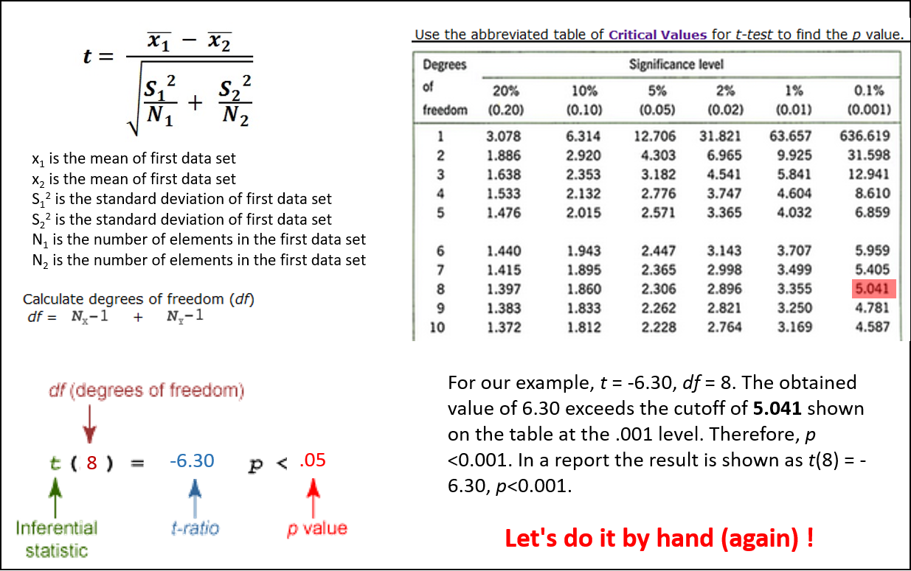

```{r eval = TRUE,  message=F, include= FALSE, warning=F, purl=F, results="hide"}
knitr::purl('stat_1.Rmd', documentation = 0)
```

```{r echo=FALSE, purl=F}
xfun::embed_file('stat_1.Rmd')
```


```{r echo=FALSE, purl=F}
xfun::embed_file('stat_1.R')
```

```{r echo=FALSE}
xaringanExtra::use_clipboard()
```

```{r echo=FALSE, purl=F}
xfun::embed_file('data/sf_res.csv')
```


-----------------------

**Statistics, the science of collecting, analyzing, presenting, and interpreting data.**

```{r,  eval=T, warning=F, message=F}
library (psych)
library (tidyverse)
library(gridExtra)
library(car)
library(ggpubr)
library(rstatix)
```

Sample survey methods are used to collect data from observational studies, and experimental design methods are used to collect data from experimental studies. The area of descriptive statistics is concerned primarily with methods of presenting and interpreting data using graphs, tables, and numerical summaries. Whenever statisticians use data from a sample—i.e., a subset of the population—to make statements about a population, they are performing statistical inference. Estimation and hypothesis testing are procedures used to make statistical inferences. Probability plays a key role in statistical inference; it is used to provide measures of the quality and precision of the inferences. 


The data set `sf_res.csv` is extracted from Hsu et al. (2020) and raw data are available [here] (https://github.com/NTU-FRELab/stranger-things.git). The data set describe organismal traits in two soft coral species (see original paper for a full description of variable names, methods and analyses.

```{r}
softies<-read.csv('data/sf_res.csv', sep=',', header=T)
str(softies)
softies$sample_no<-NULL
softies$species<-as.factor(softies$species)
softies$depth<-as.factor(softies$depth)
str(softies)
```
# Descriptive

## All-at-once

Descriptive statistics are extracting basic information from a data set. They are usually used to get a quick idea of possible differences, data distribution, or just summarize them. They are easy to extract on a single variable, but it may be a bit more complicated to get the same information on multiple variables at once. If you are familiar with the pivot table functionality in excel, the same can easily accomplished in R such as here using the functions  as `describe` and/or `describeBy`. Let's explore our `softies` data set

+ A quick `summary` of our data set in R (review): 

```{r,  eval=T}
summary(softies)
```
+ A more detailed summary can be obtained using the function `describe` from the package `psych`.

```{r,  eval=T}
psych::describe(softies[,-c(1:2)])
```

+ This is not very informative as we know we have two species. 

```{r,  eval=T}
psych::describe (softies[,-c(1:2)]~species)
psych::describeBy (softies[,-c(1:2)],softies$species)
```

## Counts & proportions

Simple tabulation (count) summary are made using`table`

```{r,  eval=T}
# One variables
prop.table (table(softies$species))

# two variables
table(softies$depth, softies$species)
prop.table (table(softies$depth, softies$species))

# three variables, with nicer formatting after adding a random variables
softies_2<-softies
softies_2$site<-rep(c("A", "B"),10)
ftable(softies_2$depth, softies_2$species, softies_2$site)
```

## `aggregate` & `apply`

We previously applied a diversity of function on a selected vector, created a filter and applied it on subgroups. In `softies`, the ratio represents the amount of chl c / chl a in the samples. It is informing on the use of light. 

```{r, message=T, results=T, echo=F}
ratio.plot=softies[,c('species','ratio')]
s=ggplot(data=ratio.plot, aes(x=species, y=ratio, fill=species))
ratio_main_title = expression(paste("Ratio chlorophylls", italic(" c/a")))
ratio_y_title = expression(paste("ratio", italic(' c/a'))) 
s + geom_violin(trim = FALSE)+
  geom_jitter(shape=16, position=position_jitter(0.1))+
  labs(title= ratio_main_title, x="Species", y=ratio_y_title)+
  theme_bw()+
  theme(legend.position='none')+
  theme(axis.text.x= element_text(face="italic"))+
  theme(plot.title= element_text(hjust="0.5"))+
  scale_y_continuous(limits=c(0.2,0.6))
```

```{r,  eval=T}
 
mean(softies$ratio)
lit <- softies$species == 'Litophyton sp.'
mean(softies$ratio[lit])
```

Descriptive statistics can be calculated on subgroups using `aggregate` and `apply` functions. The difference between the two is that the 2nd argument in `aggregate` must be a list while in `tapply` it can be a list but this is not mandatory. As a consequence, the output of `aggregate` is a data frame while the one of `tapply` is an array (basically, you deal with the list before or after).   

```{r,  eval=T}
aggregate(softies$ratio,list (species=softies$species),FUN="median")
tapply(softies$ratio,softies$species, FUN="median")
```

The wide family of `apply` functions  represents common alternatives to **loops**. You can read more about the wide application of these functions in many online resources.


<p class="comment">
**Practice 7.1** Using the data `iris` explore how the four traits vary among flower species. (1) Use `boxplot` as visual summaries then extract descriptive statistics by species (`describeBy` or others) (2) Count number of observations in each trait and species (it should result in a table of three species by four traits filled with 50 values) (3) Calculate the `median` of each variable by `Species`, then calculate the `mean` by `Species` but for the `Sepal.Length` only.
</p>

```{r, class.source = "fold-hide",  eval=F}
plot1 <-ggplot(iris, aes(x=Species, y=Sepal.Length)) + 
  geom_boxplot()
  
plot2 <-ggplot(iris, aes(x=Species, y=Sepal.Width)) + 
  geom_boxplot() 
  
plot3 <-ggplot(iris, aes(x=Species, y=Petal.Length)) + 
  geom_boxplot() 
  
plot4 <-ggplot(iris, aes(x=Species, y=Petal.Width)) + 
  geom_boxplot() 
  
grid.arrange(plot1, plot2,plot3, plot4, ncol=2)
describeBy (iris, iris$Species)

iris %>% group_by(Species) %>% summarise(across(c(1:4), length))
aggregate(iris[,1:4],by=list(iris$Species), median)
tapply(iris$Sepal.Length , iris$Species, mean)
```

# Hypothesis testing

One of the most basic concepts in statistics is hypothesis testing and something called **The Null Hypothesis**. This class is not about statitics but some basic concepts and understanding are needed. The amazing YouTube Channel [StatQuest](https://www.youtube.com/c/joshstarmer) can help you with that. Josh Starmer is a professor and **a musical artist** at University of North Carolina at Chapel Hill. You have hours of [enjoyment](https://youtube.com/playlist?list=PLblh5JKOoLUK0FLuzwntyYI10UQFUhsY9) to listen music and learn about stats. Today, let's got to the fundamental of statistics and explanation about [The Null Hypothesis]((https://www.youtube.com/watch?v=0oc49DyA3hU&list=PLblh5JKOoLUK0FLuzwntyYI10UQFUhsY9&index=8) is a perfect introduction to the topic.  

The correct formulation of the **hypotheses** for what you want to test is crucial: *H0* stands for the null hypothesis - no difference is detected (does not mean there is no difference), *H1* stands for the alternative hypothesis - the presence of a difference. 

Two broad categories of statistics can be distinguished parametric (assuming normal distribution & homoscedasticity - video 3) and non parametric (no assumption of normality).

Note: In these tests, it is important to understand the concept of degrees of freedom: It refers to **the maximum number of logically independent values**, i.e. values that have the freedom to vary in the data sample. Look [here](https://www.youtube.com/watch?v=N20rl2llHno&ab_channel=zedstatistics) if you are not clear with this term, as it is the foundation you will need later on.

| Simply, to calculate the degrees of freedom for a sample mean, you can use the formula $df=n-1$, where $n$ is the sample size as we just only one number will determine the mean; the others have the freedom to vary.


## Correlations


### Pearson's correlation (parametric)
  
  + $r$ pearson coefficient
$$
r = \frac{{}\sum_{i=1}^{n} (x_i - \overline{x})(y_i - \overline{y})}
{\sqrt{\sum_{i=1}^{n} (x_i - \overline{x})^2(y_i - \overline{y})^2}}
$$
  + Formula for the $t$ test fro the correlation coefficient:
$$
t = r\sqrt\frac{n-2}{1-r^2}
$$
___________with a degrees of freedom equal to $n-2$


Math may look scary for some of you but it is actually very easy to compute (see a demo in step-by step demo in excel [here](.\documents\demo_stats.xlsx). In R, `Pearson` correlation can easily be computed using `cor.test`. 

+ Confirming calculation of `students` in Excel with R 

```{r,  eval=T}
students<-read.table('https://www.dipintothereef.com/uploads/3/7/3/5/37359245/students.txt',header=T, sep="\t", dec='.')
# HO: no significant relationship between height and shoesize
# H1: significant relationship between height and shoesize
x1<-students$height
y1<-students$shoesize
s1<-students[,1:2] # a matrix
# Pearson correlation
# cor(x1,y1)
# cor(s1)
cor.test(x1,y1)
```

+ Using `softies` and examining relationship between amounts of chlorophyll in corals. 

```{r,  eval=T}
# HO: no significant relationship between the amounts of chl a and c
# H1: significant relationship between the amounts of chl a and c
x2<-softies$chla.afdw
y2<-softies$chlc.afdw
s2<-softies[,c(12,14)] # a matrix
# Pearson correlation
# cor(x,y)
# cor(s)
cor.test(x2,y2)
```

This relationship is usually represented with it confident interval on a scatter plot.

```{r,  eval=T}
ggplot(softies, aes(x = chla.afdw, y = chlc.afdw)) + 
  geom_point() +
  stat_smooth(method = "lm", col = "red")
```


### Spearman's correlation (non parametric)

It is based on ranking. Basically it tests for a monotonic relationship. `method` is added as an argument (default `pearson`) 
```{r,  eval=T}
w<-(1:100)
z<-exp(w)
cor.test(w,z,method='spearman')
# cor.test(w,z,method='pearson') 
```

<p class="comment">
**Practice 7.2** Rank `students` by height. Use `fix` to edit `shoesize` in the way that small individuals will have big feet. Compare $t$ and $p$ values from the correlation made earlier between the two variables. Examine the change in the confidence interval with a plot.
</p>

## Chi-square test

Also called a goodness-of-fit test: observed vs theoretical. 

+ A casino example: all results should be equally probable

```{r,  eval=T}
#Cast 240 times a die. We counted occurrence of 1,2,3,4,5,6
die<-data.frame(obs=c(55,44,35,45,31,30), row.names=c('Cast1','Cast2','Cast3','Cast4','Cast5','Cast6'))
chisq.test(die)
```

+ Hardy-Weinberg: known frequency

A common biological application of a Chi-square test is the Hardy-Weinberg equilibrium. Genotypes at the Hardy-Weinberg equilibrium (HW-equilibrium) will follow: *p*2 + 2*pq* + *q*2 = 1 at panmixia (random mating, *p* and *q* represent allele frequency). In this case, we want to compare our observation to a theoretical distribution. Let's assume 2 alleles (*A* and *T*) with observed genotypes in a population: 750 *AA*, *50* AT, 200 *TT* => *f(A)*: 0.775 / *f(T)*= 0.225. Theoretical distribution should follow: 0.60(*p2*), 0.5 (*2pq*), 0.05 (*q2*) with *p2* + *2pq* + *q2* = 1. Is our population at the HW-equilibrium (H0)?

```{r,  eval=T}
obs <- c(750, 50, 200)
exp <- c(0.60, 0.35, 0.05)
chisq.test (x=obs, p=exp)
```

+ Frequencies

Chi-square test can simply be used to compare the distribution of frequencies in two populations: 

```{r,  eval=T}
F <- matrix(nrow=4,ncol=2,data=c(33,14, 8,18,31,25,14,12))
chisq.test(F) # alternative see `fisher.test`
```

## Student's t-test

Several version of Student's t-test exist: **one sample** compared to a known mean, **two samples** (with variance equal - Student's or with unequal variance - Welsh's), **paired samples** (compare two dependent (e.g. before-after) samples). 


```{r,  eval=T}
# One sample
t.test (softies$ratio, mu=0.4)
# Two sample (with equal variances)
t.test (softies$ratio~softies$species, var.equal = TRUE)
# Two sample (with unequal variances) 
t.test (softies$chla.afdw~softies$species)
# Two sample paired t.test
# ?sleep
sleep2 <- reshape(sleep, direction = "wide", idvar = "ID", timevar = "group")
t.test (sleep2$extra.1,sleep2$extra.2,paired=T )
# same as: t.test(Pair(extra.1, extra.2) ~ 1, data = sleep2)
```

**Important**, by default `t.test` uses Welch correction assuming unequal variances between samples. In the case of a two samples assuming equal variances, the *t* statistic is obtained as following:


See the step-by step demo in excel [here](.\Data\demo_stats.xlsx)).


<p class="comment">
**Practice 7.3** Using `iris`. Does `Sepal.Lenght` differ between species `setosa` and `versicolor`? Make a plot, define your hypotheses, test your hypotheses.
</p>


```{r, class.source = "fold-hide",  eval=F}
set <- iris[iris$Species == "setosa", ]$Sepal.Length
ver <- iris[iris$Species == "versicolor", ]$Sepal.Length
boxplot(set, ver)
setver <- t.test(set, ver, var.equal = TRUE, paired = FALSE)
```

## Mann-Whitney 

A non-parametric alternative for the comparison of two samples: Mann-Whitney U-test (independent) or Wilcoxon W-test (dependant). Assuming normality assumptions are violated.

```{r,  eval=T}
## One-sample test.
## Hollander & Wolfe (1973), 29f.
## Hamilton depression scale factor measurements in 9 patients with
##  mixed anxiety and depression, taken at the first (x) and second
##  (y) visit after initiation of a therapy (administration of a
##  tranquilizer).
x <- c(1.83,  0.50,  1.62,  2.48, 1.68, 1.88, 1.55, 3.06, 1.30)
y <- c(0.878, 0.647, 0.598, 2.05, 1.06, 1.29, 1.06, 3.14, 1.29)
depression <- data.frame(first = x, second = y, change = y - x)
wilcox.test(change ~ 1, data = depression) # Formula interface to one-sample
wilcox.test(Pair(first, second) ~ 1, data = depression) # Formula interface to paired tests

## Two-sample test.
### Ozone
boxplot(Ozone ~ Month, data = airquality)
wilcox.test(Ozone ~ Month, data = airquality, subset = Month %in% c(5, 8))
### wilcox_test in package coin for exact, asymptotic and Monte Carlo conditional p-values, including in the presence of ties. 

## Softies
boxplot(prot.afdw~species, data=softies)
shapiro.test(softies$prot.afdw) # data are not normal
qqnorm(softies$prot.afdw) 
qqline(softies$prot.afdw)
wilcox.test (softies$prot.afdw~softies$species) 
```

Two or more samples? `kruskal.test` also perfoms a rank sum test. Kruskall-Wallis test (KW-test) is a non-parametric (assumption free) version of 1-way ANOVA.

```{r,  eval=T}
kruskal.test(Ozone ~ Month, data = airquality)
# see also from rstatix
res.kruskal <- airquality %>% kruskal_test(Ozone ~ Month)
res.kruskal
```

From the output of the Kruskal-Wallis test, we know that there is a significant difference between groups, but we don’t know which pairs of groups are different.

A significant Kruskal-Wallis test is generally followed up by **Dunn’s test** to identify which groups are different. It’s also possible to use the Wilcoxon’s test to calculate pairwise comparisons between group levels with corrections for multiple testing.

```{r,  eval=T}
# Pairwise comparisons
oz <- airquality %>% 
  dunn_test(Ozone ~ Month, p.adjust.method = "bonferroni") 
oz
```

There was a statistically significant differences between treatment groups as assessed using the Kruskal-Wallis test (p < 0.001). Dunn’s test identified differences between groups 5 & 7, 5 & 8, 7 & 9, 8 & 9. Note the use of an adjusted p-value in case of multiple comparison. 

```{r,  eval=T}
oz <- oz %>% add_xy_position(x = "Month")
ggboxplot(airquality, x = "Month", y = "Ozone") +
  stat_pvalue_manual(oz, hide.ns = TRUE) +
  labs(
    subtitle = get_test_label(res.kruskal, detailed = TRUE),
    caption = get_pwc_label(oz)
    )
```

## Variances

Variance tests (F-tests) are used to determine if the variances of two (or more) samples are equal.  F-test are generally very sensitive to the non-normality of the data and can also be assessed visually using `boxplot` and qqplot among other visualization. The **homoscedasticity** (or **homogeneity of variance**) is a very important assumption of parametric statistics.

```{r, eval=F}
# Test of variance: we test HO: homogeneous, H1:heterogeneous
fligner.test (softies$ratio ~ softies$species)
fligner.test (softies$chla.afdw ~ softies$species)
```

Different tests ov variance exist, each with different sensitivity to non-normality in its impact on heteroscedasticity. Another example using the `ToothGrowth` data set (`car` package). 

```{r, eval=F}
tg<-ToothGrowth
tg$dose<-factor(tg$dose)
boxplot(len~dose*supp, data=tg)
# also work with: boxplot(len ~ interaction (dose,supp), data=tg)
# or: plot(len ~ interaction (dose,supp), data=tg)
bartlett.test(len~interaction (supp,dose),data=ToothGrowth) # sensitivity non-normality +++
leveneTest(len~interaction (supp,dose),data=ToothGrowth) # sensitivity non-normality ++
fligner.test(len~interaction (supp,dose),data=ToothGrowth) # sensitivity non-normality +
```

More on Analysis of Variance (ANOVA) next week.


<p class="alert">
**Practice 7.4** Create your __own__ `pearson.test` function. (e.g. you will not use the above `cor.test` function but you will code your own function). The function should (at least) be able to test for the correlation  between two variables. You will need  to check at `?pt` (or similar function) in order to extract the p-value. You can "dissect" the code source of the current `cor.test` function using  `getAnywhere("cor.test.default")`. Using the `rairuoho` dataset, please use your customized function to test correlation between length at day 3 & day 4 then day 3 & day 8 in each treatment (nutrient and water). Interpret results. This homework must be prepared in *.Rmd* format, which you will knit as a *.html* file. You will **push** your files in a public repository accessible via your Github account. You will email me [vianneydenis@g.ntu.edu.tw] with the address (URL) of this repository (e.g. https://github.com/vianneydenis/OCEAN5098B.git) **before next Monday** so that I can review your work. The **title of your email** should be: `Practice 7.4 (your name: your student number)`.
</p>
