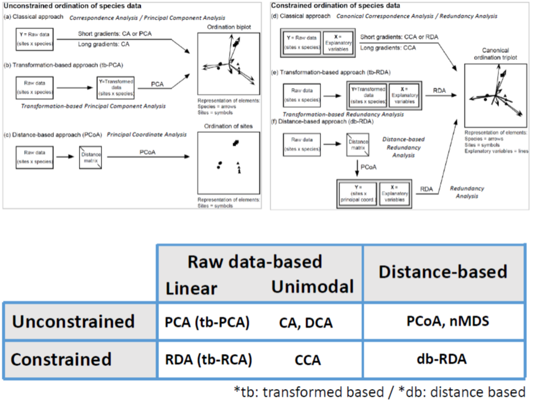

```{r eval = TRUE,  message=F, include=F, warning=F, purl=F, results="hide"}
knitr::purl('stat_3.Rmd', documentation = F)
```

```{r echo=FALSE}
xaringanExtra::use_clipboard()
```

```{r echo=FALSE, purl=F}
xfun::embed_file('stat_3.Rmd')
```

```{r echo=FALSE, purl=F}
xfun::embed_file('stat_3.R')
```

-----------------------

```{r, message=F, warning=F}

library(vegan)
library(qgraph)
library(ade4)
library(mvabund)
library (pvclust)
library(factoextra)
library(ecodist)
library(tree)
library(rpart)
library(ggplot2)
library(randomForest)
library(caret)
library(rattle)

# to be careful
library(mvpart) # install_github("cran/mvpart", force = T) # after devtools
library(MVPARTwrap) # install_github("cran/MVPARTwrap", force = T) # after devtools

#  functions from Borcard et al. 2011
source('https://www.dipintothereef.com/uploads/3/7/3/5/37359245/coldiss.r') 


```

Ecological phenomena are inherently complex, and it is rare that a single variable is sufficient to describe an ecological system, entity, or interaction. Rather, multiple response variables - such as the abundances of multiple species - are often measured to gain ecological insight. In addition, it is common to add multiple explanatory variables to an analysis in an attempt to explain the variation in the response data. Multivariate analyses contend with the complexity of simultaneously analysing **multiple response variables**. Generally, multivariate approaches are favoured to multiple executions of univariate methods as they save time and conserve statistical power which is quickly lost through *multiple testing*. In some cases, taking multiple variables into account simultaneously may reveal patterns that would not be detectable by univariate methods.

<center>
![*__Comparaison between univariate and multivariate analyses__: Univariate data sets feature a single response variable (R1). This may be analysed against one or more explanatory variables (E1-E3). Multivariate data sets include multiple response variables (R1...Rn). Multivariate analysis methods allow the evaluation of all response variables simultaneously, rather than requiring multiple executions of univariate methods. In the latter case, multiple testing occurs, which decreases the statistical power of the analysis.*](illustrations/multi_intro.png){width=100%}
</center>

Multivariate data are common in  environmental sciences, occurring whe ever we measure several response variables from each replicate sample. Questions like how does the species composition of a community vary across sites, or how does the shape of trees (as measured by several morphological traits) vary with altitude are multivariate questions.

Johnson and Wichern (2002) suggest five types of scientific inquiry most suited to the application of multivariate methods.

+ **Sorting and grouping**: Many ecological questions are concerned with the similarity or dissimilarity of a collection of entities and their assignment to groups. Several multivariate methods, such as *cluster analysis* and *non-metric dimensional scaling*, allow detection of potential groups in the data. Active classification based on multivariate data may also be performed by methods such as linear discriminant analysis.

+ **Data reduction or structural simplification**: Several multivariate methods, such as *principal components analysis*, allow the summary of multiple variables through a comparatively smaller set of 'synthetic' variables generated by the analyses themselves. Thus, high-dimensional patterns are presented in a lower-dimensional space, aiding interpretation.

+ **Investigation of the dependence among variables**: Dependence among response variables, among response and explanatory variables, or among  explanatory variables is of key interest. Methods that detect dependence, such as *redundancy analysis*, are valuable in detecting influence or covariation.

+ **Hypothesis testing**: Exploratory techniques can reveal patterns in data from which hypotheses may be constructed (however, be careful of data dredging). Several methods, such as *MANOVA*, *PERMANOVA*, *ANOSIM*  or the *Mantel test*, allow the testing of statistical hypotheses on multivariate data. Appropriately constructed assertions may thus be tested.

+ **Prediction**: Once the dependence among variables has been detected and characterised, multivariate models may be constructed to allow prediction.

Note that according to the field of research there is a trend to favor some tools more than others. 


# Data Structure

In ecology, the'typical' dataset used in multivariate analyses will be represented by: 

+ objects in row (e.g. samples can be sites, time periods, etc.)

+ measured variables for those objects in columns (e.g. species, environmental parameters, etc.)

<center>

</center>

Measured variables can be binary, quantitative, qualitative, rank-ordered, or even a mixture of them. 

# Transformations

If variables do not have uniform scale (e.g. environmental parameters measured in different units or scales), they usually have to be transformed (standardized).Occasionally, the variables in a "raw" data set have properties that violate an assumption of a statistical procedure (e.g. normally distributed values) or which cannot be compared to other variables due to differences in scale or variability. For example, principal components analysis (PCA) requires that variables be linearly related to one another and on roughly the same scale or will perform poorly. A transformation involves the application of a mathematical procedure to every value of a given variable or set of variables to create a new set of values. The new values of the transformed variables should still represent the data, but will be more amenable to analysis or comparison.  A few basic but popular data transformation are described [here](https://sites.google.com/site/mb3gustame/reference/data-transformations).  The main motivations for applying these transformations include placing variables on similar scales, simplifying calculations, meeting distributional assumptions (such as normality), and dealing with **heteroscedasticity**. Some transformations (see **Ecologically motivated transformations**) are motivated to improve effectiveness of many analysis in representing ecological relationships. Examples:

- **Hellinger** Particularly suited to species abundance data, this transformation gives low weights to variables with low counts and many zeros. The transformation itself comprises dividing each value in a data matrix by its row sum, and taking the square root of the quotient.

- **Chord** Like the Hellinger transformation, this transformation gives low weights to variables with low counts and many zeros. This transformation divides each value in a data matrix by the square root of its marginal sum of squares. It thereby sets the marginal (either row or column) sum of squares to one.

- **$\chi^2$ distance** This transformation is the product of the values transformed by the $\chi^2$ metric and the square root of the sum of all counts in the data matrix. This is the distance used in correspondence analysis (CA) and canonical correspondence analysis (CCA) . 

**Before you  begin transforming your data, ensure there is a defined and well-supported reason to do so. Common rationale includes linearising, normalising, or standardising data in order to respect a method's assumptions.**

The function `decostand()` from the `vegan` package offers an easy way to transform your data (see also `scale()` from the base package and `boxcox()` from the MASS package). 

The `varespec` data frame has **24 rows** and **44 columns**. Columns are estimated cover values of **44 lichen species**. The variable names are formed from the scientific names, and are self explanatory for anybody familiar with vegetation type / lichen species. The associate `varechem` data frame has **24 row** and **14 columns**, giving the soil characteristics of the very same sites as in the varespec data frame. 

```{r,  eval=T}
# ?varespec
data (varespec); data(varechem)
varespec[1:5,1:5]
varechem[1:5,1:5]
```


- Basic transformation

```{r,  eval=T, warning=F}
# Transforming  positive  data to a logarithmic
# scale reduces the range of the data set.
varespec.log<-decostand(varespec,'log')
varespec.log[1:5,1:5]
```

- Transformations in aid of comparability

```{r,  eval=T, warning=F}
# Centring by translation, standardize.
# Obj is to remove differences in scale due
# due to diff magnitudes between variables
varechem.stand<-decostand(varechem,'stand')
varechem.stand[1:5,1:5]
# making sure `rowSums is the same
varespec<-decostand(varespec,'total')
```

- Ecologically motivated transofrmations

```{r,  eval=T, warning=F}
# Low weights to variables with
# low counts and many zeros
varespec.hell<-decostand(varespec,'hellinger')
varespec.hell[1:5,1:5]
```

# (Dis)similarities

Most methods of multivariate analysis are **explicitly** or **implicitly** based on the comparison of all possible pairs of objects or descriptors.

+ Comparison takes the form of association measures which are assembled in a square and symmetrical association matrix of dimension $n$ x $n$ when objects are compared, or $p$ x $p$ when variables are compared. 

+ When pairs of objects are compared, the analysis is said to be in **Q mode**.When pairs of descriptors are compared, the analysis is said to be in **R mode**.


<center>
{width=50%}
</center>


In **R mode** correlation type coefficents are commonly used. In **Q** mode, the choice of a suitable **association coefficient** is crucial for further analysis. They are **MANY** of such coefficients with many variations. We can distinguished two classes of association measures based on how they deal with the **double-zeros** problem.

+ The **symmetrical coefficients** will consider the information from the double-zero (also called 'negative matched').

The **zero value** has the **same meaning** as any other values (*e.g. 0mg/L of O2 in deep anoxic layer of a lake*) during the comparison. 

+ The **asymmetrical coefficients** will ignore the information send from the double-zero

The **zero value** in matrix of species abundances (or presence-absence) can **not** always be counted as an indication of **resemblance** (presence has an ecological meaning, but no conclusions on the absence: e.g. *is the absence of a given nationality in this class means that no students from this specific country are in NTU? And is it an element to evaluate the similarity with other university (high similarity because many nationalities probably absent? No, but at same sample size 1/0 may become informative*)
 
When analyzing species data (or other data set with many 0), it is often recommended to use asymmetrical coefficients unless you have reason to consider each double absence in the matrix (*e.g. controlled experiment with known community composition or ecologically homogeneous areas with disturbed zones*)

You can download a spreadsheet [here](documents/distance-metrics.xlsx) to check how a few common metrics (Bray-Curtis, Canberra, Manhattan, Euclidean  ) are computed. Many of the common dissimilarity indices can be computed using the function `vegdist()` of  the `vegan` package.

## Symmetrical coefficients 

**Euclidean distance** is the most commonly-used of our distance measures. For this reason, Euclidean distance is often just to referred to as “distance”. When data is dense or continuous, this is the best proximity measure. The Euclidean distance between two points is the length of the path connecting them.This distance between two points is given by the Pythagorean theorem.

$E_d=\sqrt{\sum (x_i-y_j)^2}$

Here the abundance of a species from one sample is subtracted from its counterpart in the other sample. Instead of ignoring the sign, the result is squared (which gives a positive value.

```{r}
env.euc<-vegdist(varechem.stand, method='euc')
env.euc
```

Hellinger transformation (and Chord transformation) addresses the **double-zeros** problem, so that Euclidean distance can be computed on species data set:

```{r}
spe.euc<-vegdist(varespec.hell, method='euc')
spe.euc
```

Check you have a triangular matrix.


## Asymmetrical coefficient


**Bray-Curtis** dissimilarity is the **golden** ditance metric in ecology. At first, you subtract the abundance of one species in a sample from its counterpart in the other sample but ignore the sign. The second component is the abundance of a species in one sample added to the abundance of its counterpart in the second sample. If a species is absent, then its abundance should be recorded as 0 (zero). 

$BC_d =  \frac {\sum |x_i-x_j|}{\sum(x_i+x_j)}$

```{r}
# default option using vegdist()
spe.bc<-vegdist(varespec)
spe.bc
```


**Jaccard Similarity** is used to find similarities between sets on the only base of presence and absence. The Jaccard similarity between two sets \( A \) and \( B \) is defined as:

\[
J(A, B) = \frac{|A \cap B|}{|A \cup B|}
\]

```{r}
# Jaccard dissimilarity matrix using vegdist()
spe.jd <- vegdist(varespec,'jac',binary=T) # binary p/a 
```

This measure is  important when comparing $\beta$-diversity among sites for example. Other distances applying to presence-Absence data: Sørensen, Ochiai, etc.  


**Note**: For mixed types variables, including categorical or qualitative multiclass variables use **Gower's similarity**. It is easily computed in R using `daisy` function built in the `cluster` package. Avoid `vegdist` with `method='gower'`, which is appropriate for quantitative and presence-absence, but not for multiclass variables. Overall, `gowdis` from the package `FD` is the most complete function to compute Gower's coefficient in R, and commonly used in **trait-based approach** analyses. 

## Visualization

Among the many ways to visualize similarity matrix:  the function `coldiss` (Borcard et al. 2011) and the package `qgraph` offer nice options:

- Heat map

```{r,  eval=T}
coldiss(spe.bc,byrank=F,diag=T)
```

- Network

```{r,  eval=T}
qgraph(1-spe.bc, layout='spring', vsize=4)
```


<p class="comment">
**Practice 7.5** Using the `tikus` data set from the package `mvabund` - check `?tikus`. Select observation for the year  1981, 1983, and 1985 only (noted `81`, `83` and `85`). Build a  Bray-Curtis dissimilarity matrix among selected observations. Plot heat map of this matrix. Build a network of **SPECIES** co-occurrence (presence/absence) based on your selection of years.
</p>

# Clustering

We often aim to recognize discontinuous **subsets** in an environment which is represented by discrete (e.g. taxonomic) changes but  perceived as continuous changes in ecology.

**Clustering** consists in partitioning the collection of objects (or descriptors in R-mode). Clustering **does not test** any hypothesis.

**Clustering** is an explanatory procedure which helps to understand data with complex structure and multivariate relationships, and is a very useful method to extract knowledge and information especially from large datasets.

Many **clustering** approaches rely on association matrix, which stresses on the **importance** of the right choice of an appropriate association coefficient.

The definition of a cluster varies, and different cluster analysis techniques may approach the problem very differently. We recognize different families of clusering:


1. **Sequential** or **Simultaneous** algorithms (most of the clustering algorithm)

2. **Agglomerative** or **Divisive**

3. **Monothetic** (cluster members with common prop.) versus **Polythetic** (distance between elements defines membership)

4. **Hierarchical** versus **Non-hierarchical** (flat)

5. **Probabilistic** (decision tree) versus **non-probabilistic** methods

6. **Hard** and **Soft** (may overlap)

Numerical classification often requires two arguments: the matrix of distances among samples (ecological resemblance) and the method to us *e.g.*: name of the clustering algorithm.  Clustering produces tree-like structure. Again be careful of **data dredging**. You don't choose clustering method according to how your tree looks like.The suitable method is usually carefully **selected** and/or **evaluated** according to the data set you are dealing with and your initial hypotheses (some may not make sense). Below we will describe two widely-used approaches of clustering. We will aslo plant some seeds ...

## Hierarchical Clustering

Hierarchical cluster analysis may be performed using an "object x object" matrix of (dis)similarities or distances. It attempts to find a good, although perhaps not the best, grouping of objects based on the distances supplied in a hierarchical manner, first grouping objects with the lowest dissimilarities before proceeding. Therefore grouping may be presented as a dendrogram. Many of these algorithms are greedy (i.e. the optimal local solution is always taken in the hope of finding an optimal global solution) and heuristic, requiring the results of cluster analysis to be evaluated for stability by, for example, bootstrapping procedures.

Agglomerative clustering is a widespread approach in hierarchical cluster analysis. Agglomerative algorithms successively merge individual entities and clusters that have the highest similarity values. These typically use a linkage criterion  to determine the (dis)similarity values for clusters formed during the algorithm's execution. These are valid both for the clustering of objects and of variables provided some measure of (dis)similarity; however, note other clustering techniques may not share this flexibility. Agglomerative algorithms end when all the individual entities and clusters have been merged into a single cluster. Below some common linkage criteria are summarised. 

In R, the function `hclust()` allows to implement some of the common hierarchical clustering algorithms. `pvclust()` from the `pvclust` allows bootstrapping and indication of highly supported clusters with `pvrect()`.

### Common algorithms


**SINGLE LINKAGE AGGLOMERATIVE CLUSTERING** (neighbor sorting)

Single linkage allows object to agglomerate easily to a group since a link to a single object of the group suffices to induce fusion. **This is the 'closest' friend' procedure**.

  - commonly produced chain dendrograms: a pair is linked to a third object
  
  - agglomerates objects on the basis of their shortest pairwise distance
  
  - partitions difficult to interpret, but gradients quite clear
  
  
The `doubs` dataset (`ade4` package) gives environmental variables, fish species and spatial coordinates for 30 sites along a river. 
  
```{r class.source = "fold-show", eval=T, warning=F}
# Step 1: dataset
# ?doubs
data(doubs)
spe.db<-doubs$fish
spa.db<-doubs$xy
# remove empty sample 8 from both datasets
spe.db <-spe.db[-8,]
spa.db<- spa.db[-8,]
# Step 2: chord distance = normalization + euclidean
spe.db.norm<-decostand(spe.db,'normalize') 
spe.db.ch<-vegdist(spe.db.norm,'euc') 
# Step 3: single linkage agglomerative clustering
spe.db.ch.single <-hclust(spe.db.ch,method='single') 
# Step 4: plot dendrogram
```

Apply well for examining change in species composition along environmental gradients. 

**COMPLETE LINKAGE AGGLOMERATIVE CLUSTERING** (furthest neighbor sorting)

A group admits a new member only at the distance corresponding to the furthest object of the group: **one could say that the admission requires unanimity of the group**.

  - dendrograms look a bit like rakes – some cluster merge together at the highest dissimilarity

  - allow an object (or a group) to agglomerate with another group only at the distance corresponding to that of the most distant pair of objects 

```{r class.source = "fold-show", eval=T, warning=F}
spe.db.ch.complete<-hclust(spe.db.ch,method='complete') 
```

**AVERAGE AGGLOMERATIVE CLUSTERING** (e.g. UPGMA)

The **most common** method in ecology (species data). It comprises **four sub-methods** that are based on **average** or **median** dissimilarities among objects,  **centroids** of cluster, or **McQuitty**'s method. 
  
<center>
{width=75%}
</center>

```{r class.source = "fold-show", eval=T, warning=F}
spe.db.ch.UPGMA<-hclust(spe.db.ch,method='average') 
```

**WARD'S MINIMUM VARIANCE CLUSTERING**

**Ward** method is also a favorite  clustering method. Unlike the others, instead of measuring the distance directly, it analyzes the variance of clusters. Ward’s is said to be the most suitable method for quantitative variables. It is based on linear model criterion of least square: the within-group sum of square is minimized.
 
```{r class.source = "fold-show", eval=T, warning=F}
spe.db.ch.ward<-hclust(spe.db.ch,method='ward.D') 
```

**Note**: Ward method is based on Euclidean model. It should not be combined with distance measures, which are not strictly metric such as the popular Bray-Curtis distance.


```{r class.source = "fold-show", eval=T, warning=F}
par(mfrow = c(2, 2))
plot(spe.db.ch.single, main='Single linkage agglomerative clustering' ) 
plot(spe.db.ch.complete, main='Complete linkage agglomerative clustering') 
plot(spe.db.ch.UPGMA, main='Average (UPGMA) agglomerative clustering') 
plot(spe.db.ch.ward, main='Ward clustering')
```

### Clustering quality

There are many ways to evaluate the overall quality of the chose clustering algorithms and therefore of their representations.

+ the **cophenetic correlation** related distances extracted from the dendrogram (function `cophenetic` on a `hclust` object) with ditances in our original distance matrices. A higher correlation means a better representation of the initial matrix. 


```{r class.source = "fold-show", eval=T, warning=F}
# Single linkage clustering
spe.db.ch.single.coph <- cophenetic (spe.db.ch.single)
cor(spe.db.ch,spe.db.ch.single.coph)

# complete linkage clustering
spe.db.ch.complete.coph <- cophenetic (spe.db.ch.complete)
cor(spe.db.ch,spe.db.ch.complete.coph)

# Average clustering
spe.db.ch.UPGMA.coph <- cophenetic (spe.db.ch.UPGMA)
cor(spe.db.ch,spe.db.ch.UPGMA.coph)

# Ward clustering
spe.db.ch.ward.coph <- cophenetic (spe.db.ch.ward)
cor(spe.db.ch,spe.db.ch.ward.coph)
```

UPGMA performs better at retaining information of our initial chord distance matrix.

* the **shepard-like diagram** is a plot that represents orginal distances against the cophentic distances. Can be combined with cophonetic correlation seen above. 


```{r class.source = "fold-show", eval=T, warning=F}
par(mfrow=c(2,2))

plot(spe.db.ch,spe.db.ch.single.coph,xlab='Chord distance',ylab='Chophenetic distance',asp=1, main=c('Single linkage',paste('Cophenetic correlation',round(cor(spe.db.ch,spe.db.ch.single.coph),3))))
abline (0,1)
lines(lowess(spe.db.ch,spe.db.ch.single.coph),col='red')

plot(spe.db.ch,spe.db.ch.complete.coph,xlab='Chord distance',ylab='Chophenetic distance',asp=1, main=c('Complete linkage',paste('Cophenetic correlation',round(cor(spe.db.ch, spe.db.ch.complete.coph),3))))
abline (0,1)
lines(lowess(spe.db.ch, spe.db.ch.complete.coph),col='red')

plot(spe.db.ch,spe.db.ch.UPGMA.coph,xlab='Chord distance',ylab='Chophenetic distance',asp=1, main=c('UPGMA',paste('Cophenetic correlation',round(cor(spe.db.ch,spe.db.ch.UPGMA.coph),3))))
abline (0,1)
lines(lowess(spe.db.ch,spe.db.ch.UPGMA.coph),col='red')

plot(spe.db.ch,spe.db.ch.ward.coph,xlab='Chord distance',ylab='Chophenetic distance',asp=1, main=c('Ward clustering',paste('Cophenetic correlation',round(cor(spe.db.ch,spe.db.ch.ward.coph),3))))
abline (0,1)
lines(lowess(spe.db.ch,spe.db.ch.ward.coph),col='red')
```

### Cluster groups

By simply watching a dendrogram, the number of groups or partition to interpret is highly subjective. Let's repeat the step above for the `varespec` data set. The UPGM tree also came out at the dendrogamm retaining the best information from our bray-curtis dissimilarity matrix.

```{r}
spe.bc.UPGMA<-hclust(spe.bc,method='average') 
plot(spe.bc.UPGMA, main='Average (UPGMA) agglomerative clustering') 
rect.hclust(spe.bc.UPGMA, k=3, border="red")
rect.hclust(spe.bc.UPGMA, k=6, border="blue")
rect.hclust(spe.bc.UPGMA, k=8, border="green")
```

Solution at 3, 5, 8? They are methods that can guide you at selecting a relevant number of groups - again danger of data dredging!

+ **Fusion Level values**

The plot of the **Fusion Level Values** is further used a diagnostic of interpretable cluster groups. It examines values where a fusion between two branches of a dendrogram occurs. 

```{r class.source = "fold-show", eval=T, warning=F}
plot(spe.bc.UPGMA$height, nrow(varespec):2, 
     type='S',main='Fusion levels - bray-curtis - UPGMA',
     ylab='k (number of clusters)', xlab='h (node height)', col='grey')
text (spe.bc.UPGMA$height,nrow(varespec):2, nrow(varespec):2, col='red', cex=0.8)
```

The graph of fusion level values shows clear jump of fusion values between 3-4  and 6-7 partitions.  


+ The **Silhouette** widths indicator (also apply for non-hierarchical clustering)

The silhouette width is a measure of the **degree of membership of an object to its cluster** based on the average distance between this object
and all objects of the cluster to which is belongs, compared to the same measure for the next closest cluster. Silhouette widths range from -1 to 1 and can be averaged over all objects of a partition. The greater the value is, the better the object is clustered. Negative values mean that the corresponding objects have probably placed in the wrong cluster (intra group variation higher than inter group variation). 

```{r class.source = "fold-show", eval=T, warning=F}
# step 1: cut your tree
cutg1<-cutree(spe.bc.UPGMA, k=6)
# step 2: calculate silhouette for the different partitions
sil1<-silhouette (cutg1,spe.bc)
# step 3: plot silhouette 
plot(sil1)
```

Repeat by changing *k*, the number of partitions 

+ the **Elbow** method

This method looks at the percentage of variance explained (SS) as a function of the number of cluster. One should choose a number of clusters so that adding another cluster doesn't give much better explanation. At some point the marginal gain will drop, giving an angle in the graph. The number of clusters is chosen at this point, hence the "elbow criterion" (wss). This is very common method to select an appropriate number of cluster to interpret.


```{r class.source = "fold-show", eval=T, warning=F}
fviz_nbclust(varespec,diss=bcdist(varespec), hcut, method = "wss", hc_method = "average")
```

+ The **Mantel** test

Compares the original distance matrix to (binary) matrices computed from dendrogram cut at various level and choose the level where matrix correlation
is the highest. The Mantel correlation is in its simplest sense, i.e. the equivalent of a Pearson r correlation but between distance matrices.

Comparison between the distance matrix and binary matrices representing partitions

```{r class.source = "fold-show", eval=T, warning=F}
## Mantel test
# Optimal number of clusters
# according to mantel statistic 
# Function to compute a binary distance matrix from groups
grpdist<-function(x){
  require (cluster)
  gr<-as.data.frame(as.factor(x))
  distgr<-daisy(gr,'gower')
  distgr
}
# run based on the UPGMA clustering
kt<-data.frame(k=1:nrow(varespec),r=0)
for (i in 2:(nrow(varespec)-1)){
  gr<-cutree(spe.bc.UPGMA,i)
  distgr<-grpdist(gr)
  mt<-cor(spe.bc,distgr, method='pearson')
  kt[i,2] <- mt
}
k.best <- which.max (kt$r)
plot(kt$k,kt$r, 
     type='h', main='Mantel-optimal number of clusters - UPGMA',
     xlab='k (number of groups)',ylab="Pearson's correlation")
axis(1,k.best, 
     paste('optimum', k.best, sep='\n'), col='red',font=2, col.axis='red')
points(k.best,max(kt$r),pch=16,col='red',cex=1.5)
```

+ `NbClust` for many others

The function `NbClust()`provides 30 indices for determining the number of clusters and proposes to user the best clustering scheme from the different results obtained by varying all combinations of number of clusters, distance measures, and clustering methods (Charrad et al. 2014).

### Bootstrapping trees

A litte handmade add-on to us use `pvclust()` from the package `pvclust` with Bray-Curtis dissimilarity (note that data set need to be transposed for using this function).

```{r}
pv.results<-pvclust(t(varespec), # to cluster rows - omit t() to cluster columns,
        method.hclust = "average",
        method.dist = function(x) vegan::vegdist(t(x), "bray"),
        n = 1000) # and other arguments you need
plot(pv.results)
```


boston.pv <- pvclust(varesspec, method.dist="correlation",  nboot=100, parallel=FALSE)


-------------------

Let's apply this on the `doubs` data set:


```{r class.source = "fold-show", eval=T, warning=F}
# Calculates hierarchical cluster analysis of species data 
spe.db.ch.UPGMA<-hclust(spe.db.ch,method='average') 
fviz_nbclust(spe.db, hcut, diss=dist(spe.db.norm, method='euclidean'),method = "wss",hc_method = "single")
# Dendrogram with the observed groups
par(mfrow=c(1,2))
plot (spe.db.ch.UPGMA)
rect.hclust (spe.db.ch.UPGMA, k = 6, border = 1:6)
# Spatial distribution of samples with projection of hierarchical classification
UPGMA.cluster <- cutree (spe.db.ch.UPGMA, k = 6)
plot (y ~ x, data = spa.db, pch = UPGMA.cluster, col = UPGMA.cluster, type = 'b', main = 'Chord distance - UPGMA method')
dev.off()
```

Let's combine heatmap and cluster


* Heat map & clustering visualization (example)

We must reorder objects (function `reorder.hclust`) so that their order in the dissimilarity matrix is respected . This does not affect the topology of the dendrogram.

```{r class.source = "fold-show", eval=T, warning=F}
spe.chwo<-reorder.hclust(spe.db.ch.UPGMA,spe.db.ch)
dend<-as.dendrogram(spe.chwo) 
heatmap(as.matrix(spe.db.ch),Rowv=dend,symm=TRUE, margin=c(3,3))
```


<p class="comment">
**Practice 7.6** Using `tikus` data set and subset on years 1981, 1983 and 1985: compute the three common clustering methods (single, complete, average) on a Bray-Curtis dissimilarities matrix. Compare resulting dendrograms using cophenetic correlation and Shepard-like diagram. Choose method with the one with the highest cophenetic correlation and produce a heat map of the reordered distance matrix together with a visualization of the related dendrogram. 
</p>


## Non-Hierarchical Clustering


Non-hierarchical clustering creates partitions but without hierarchy (think of categorizing fruits: apples, oranges, bananas). It determine a partition of the objects into k groups, or clusters, such as the objects within each cluster are more similar to one other than to objects in the other clusters.

It usually requires an initial configuration (user usually determine the number of groups, _k_), which will be optimized in a recursive process (often random). If random, the initial configuration is run a large number of times with different initial configurations in order to find the best solution.

The most known and commonly used non-hierarchical **partitioning algorithms** is **_k_-means clustering** (MacQueen, 1967), in which, each cluster is represented by the center or means of the data points belonging to the cluster.


Three  crital steps:

  + **Initialization**: _k_ observations from the dataset are used as the initial means. The **random partition** method first randomly assigns a cluster to each observation and then proceeds to the update step, thus computing the initial mean to be the centroid of the cluster's randomly assigned points. 

  + **Assignment step** Assign each observation to the cluster with the nearest mean: that with the least squared Euclidean distance (Mathematically, this means partitioning the observations according to the Voronoi diagram generated by the means) 
  
  + **Update step** Recalculate means (centroids) for observations assigned to each cluster.
  

The algorithm has **converged** when the assignments no longer change. The algorithm is not always guaranteed to find the optimum.

<center>
{width=50%}
</center>

The aims is to identify **high-density regions** in the data. To do so, the method iteratively minimizes an objective function the **total error sum of squares (TESS or SSE)**, which is the sum of the within groups sums-of squares. *It is basically the sum, over the _k_ groups, of the sums of squared distance among the objects in the group, each divided by the number of objects in the group.* The algorithm is often presented as assigning objects to the nearest cluster by distance. Using a different distance function other than (squared) Euclidean distance may prevent the algorithm from converging. Various modifications of _k_-means such as **_k_-medoids** [**PAM (Partitioning Around Medoids**, Kaufman & Rousseeuw, 1990] have been proposed to allow using other distance measures. In this case, cluster is represented by one of the objects in the cluster.


Data must be standardized prior to partitioning. With a pre-determined number of groups, recommended function is: `kmeans()` from the `stats` package. The argument `nstart` will repeat the analysis a large number of time using different initial configuration until finding the best solution.

*Note: do not forget to normalized your data*

```{r,  eval=T, message=F}
# k-means partitioning of the pre-transformed species data
spe.kmeans <- kmeans(spe.bc, centers=6, nstart=100)
# k-means group number of each observation spe.kmeans$cluster 
spe.kmeans$cluster
# Comparison with the 5-group classification derived from UPGMA clustering
comparison<-table(spe.kmeans$cluster,cutg1)
comparison
# Visualize k-means clusters 
fviz_cluster(spe.kmeans, data = varespec,geom = "point",
             stand = T, ellipse.type = "norm") 
```


The function `cascadeKM` in `vegan` package is a wrapper for the `kmeans` function. It creates several partitions forming a cascade from small (argument `inf.gr` to large values of *k* (argument `sup.gr`). The cascade proposes the 'best solution' for partitioning using the `calinski` or `ssi` criterion. Other indicators such as elbow and silhouette can also be applied looking for the best partitioning. 

```{r,  eval=T, message=F}
spe.KM.cascade<-cascadeKM(spe.bc,inf.gr=2,sup.gr=10,iter=100,criterion='calinski')
plot(spe.KM.cascade,sortg=TRUE)
```

### **Fuzzy clustering**

The **fuzzy clustering** is considered as soft clustering or **soft** _k_-means, in which each element has a probability of belonging to each cluster. In other words, each element has a set of membership coefficients corresponding to the degree of being in a given cluster. In fuzzy clustering, points close to the center of a cluster, may be in the cluster to a higher degree than points in the edge of a cluster. The degree, to which an element belongs to a given cluster, is a numerical value varying from 0 to 1. This is fundamentally different from _k_-means and _k_-medoid clustering, where each object is affected exactly to one cluster. _k_-means and _k_-medoids clustering are known as **hard** or **non-fuzzy** clustering.

In other words, in non-fuzzy clustering a fruit can be an apple or an orange (hard clustering). In soft clustering, the fruit can be an apple AND an orange at the same time but to certain degrees. 

The **fuzzy c-means (FCM)** algorithm is one of the most widely used fuzzy clustering algorithms. The centroid of a cluster is calculated as the mean of all points, weighted by their degree of belonging to the cluster. The function `fanny` [`cluster` package] can be used to compute fuzzy clustering. 'FANNY' stands for *fuzzy analysis clustering* (see `?fanny`).

<p class="comment">
**Practice 7.7** Using `iris` data set: (1) make a K-means cascade and use the silhouette width indicator to determine the optimal number of clusters. (2)  since we know that 3 species are involved, group the data into 3 clusters (common sense) using the `kmeans` function. How many points are wrongly classified? Plot both solutions and conclude.
</p>

```{r,  eval=T, message=F}
my_cols <- c("#00AFBB", "#E7B800", "#FC4E07")  
pairs(iris[,1:4], pch = 19,  cex = 0.5,
      col = my_cols[iris$Species],
      lower.panel=NULL)
```

```{r, class.source = "fold-hide",  eval=F}
fviz_nbclust(iris[, 1:4], kmeans, method = "silhouette")
spe.KM.cascade<-cascadeKM(iris[,1:4],inf.gr=2, sup.gr=10, iter=100, criterion='calinski')
plot(spe.KM.cascade,sortg=TRUE)
set.seed(1)
irisCluster<-kmeans(iris[, 1:4], 3, nstart= 20)
table(irisCluster$cluster, iris$Species)
irisCluster$cluster<-as.factor(irisCluster$cluster)
plot7<-ggplot(iris, aes(Petal.Length, Petal.Width, color = irisCluster$cluster)) + geom_point()
plot8<-ggplot(iris, aes(Petal.Length, Petal.Width, color = Species)) + geom_point()
grid.arrange(plot7, plot8, ncol=2)
# conclusions?
```

## Decision trees

Multiple variables are use to make a decision, but they can be made into multivariate. [Here](https://www.youtube.com/watch?v=7VeUPuFGJHk&ab_channel=StatQuestwithJoshStarmer) for a basic understanding of decision trees. 

### Classification And Regression Trees (CART)

The functions `tree` and `ctree` builds decision trees ([recursive partitioning algorithm](https://cran.r-project.org/web/packages/partykit/vignettes/ctree.pdf)). The first parameter is a formula, which defines a target variable and a list of independent variables.

```{r class.source = "fold-show",  eval=T}
tree1<-tree(Species~Sepal.Length + Sepal.Width + Petal.Length + Petal.Width, data=iris)
summary(tree1 )
plot(tree1)
text(tree1)
```

Another fancier option with the package `rpart`:

```{r class.source = "fold-show",  eval=T}
tree2 <- rpart(Species ~ ., data=iris, method="class")
fancyRpartPlot(tree2, main="Iris") # package rattle
```

One of the disadvantages of decision trees may be **overfitting** i.e. continually creating partitions to achieve a relatively homogeneous population. This problem can be alleviated by **pruning** the tree (CART), which is basically removing the decisions from the bottom to up. Another way is to **combine several trees** and obtain a consensus, which can be done via a process called **random forests** (bootstrapped version of CART - many trees built based on subsets of the data, in addition not all predictor variables are used every time, rather a random subset). (extra)

```{r class.source = "fold-show",  eval=T}
# Extra to exciting your curiosity
iris.rf=randomForest(Species~., data=iris, importance=TRUE, proximity=TRUE, ntree=500)
# Required number of trees gives errors for each species and the average for all species (black):
plot(iris.rf,lty=2)
# Misclassification error rates:
iris.rf$confusion
# Importance of individual predictor variables for classification (the further the value is on the right of the plot, the more important):
varImpPlot(iris.rf)
# The membership of a particular class as a function of a variable value can be displayed with this
partialPlot(iris.rf,iris,Petal.Width,"setosa")
# we can predict unclassified observations. We make up some sample new observations from the original dataset to save some time importing (the first three rows are P. setosa, lets see if RandomForest gets that right:
newobs=iris[1:3,1:4]
predict(iris.rf,newobs)
# This last plot conveys the confidence in your predictions for each individual sample. Colors represent species and points are samples. In this case, many samples can be predicted with great certainty (1) and only few classifications are questionable (approaching 0)
plot(margin(iris.rf))
```

## Multivariate Regression Trees: constrained clustering (extra)

**Multivariate regression trees** (MRT; De’ath 2002) are an extension of univariate regression trees, a method allowing the recursive partitioning of a quantitative response variable under the control of a set of quantitative or categorical explanatory variables (Breiman et al. 1984). Such a procedure is sometimes called **constrained** or **supervised** clustering.The result is a tree whose “leaves” (terminal groups of sites) are composed of subsets of 'sites' chosen to minimize the within-group sums of squares (as in a _k_-means clustering), but where each successive partition is defined by a threshold value or a state of one of the explanatory variables.


The only package implementing a complete and handy version of MRT was `mvpart`. Unfortunately, this package is no longer in CRAN, so no update is available for R versions posterior to R 3.0.3 + potential error. Nevertheless, `mvpart` can still be installed via github - let me know if you have a better option :)


```{r class.source = "fold-show",  eval=T}
data(doubs)
spe.norm<-decostand(doubs$fish[-8,], 'nor')
env<-doubs$env[-8,]

# par(mfrow=c(1,2))
spe.ch.mvpart <-
  mvpart(data.matrix(spe.norm)~.,
         env,
         margin = 0.08,
         cp=0,
         xv='min', # try 'pick' best number, '1se'
         xval=nrow(doubs$fish),
         xvmult = 100
         )
```

# Ordinations

The aim of ordination methods is to represent the data along a reduced number of orthogonal axes, constructed in such way that they represent, in decreasing order, the **main trends of the data**. In fact, we already used some type of ordinations to visualize non-hierarchical clusters.

 + The renders can be **interpreted visually or in association with other methods** such as clustering or regression

 + Most ordination methods (except nMDS) are based on the extraction of the **eigenvectors** of an association matrix
 
Two families of ordination analyses exist according to how they are dealing with environmental matrix (if any):

  + **unconstrained ordination** (indirect gradient analysis, ordination not constrained by environmental factors).They are descriptive methodologies and describe patterns. It generates hypotheses but cannot test them.

    * uncover main compositional gradients in the species data, 	structuring the community, and these gradients can be 	interpreted by known (estimated or measured) 	environmental factors
    
    * environmental variables can be used a posteriori, after the analysis
    
+ **constrained ordination** (direct gradient analysis, ordination axes are constrained by environmental factors). It tests directly  hypotheses about the influence of environmental factors on species composition*

    * relates the **species composition directly to the 	environmental variables** and extracts the variance in species 	composition which is directly related to these variable*

    * regarding environmental factors, it offers several interesting options such as **step-wise selection** of important environmental 	variables (and excluding those which are not relevant for species composition), test of **significance of the variance 	explained by environmental factors**	and **partitioning variance explained by particular environmental variables**

In addition, based on data input, two types of ordination analyses exist. 

  + **raw data**: based on analysis of raw sample-species matrices with abundance or presence/absence data. Two categories recognized, differing by assumption of species response along environmental gradient:
  
    * **linear**, species response linearly along env. gradient, which could be true for rather homogenous ecological data, where ecological gradients are not too long. **Short gradient**.

    * **unimodal**, species response unimodally along gradient, having its optima at certain gradient position. More close to reality of ecological data, more suitable for heterogenous dataset (long gradients + many zeros and turnover). **Long gradient**.
    
{width=50%}    
    


  + **distances**: distance matrix  computed by similarity/dissimilarity measures, and projecting these distances into two or more dimensional diagrams</span>



-----------------------


# Predictions (extra)

The process of constructing, evaluating, and validating  classification models, provides basis for machine learning models. Below we explore and compare perfomance four algorithms to classify and **predict** `iris` species (see `caret` package).

**Key steps**:

1- **Validation Dataset** 

The dataset is split into 80% training data (`idataset`) and 20% validation data (`validation`).

```{r class.source = "fold-show",  eval=T}
# create a list of 80% of the rows in the original dataset that we can use for training
validation_index <- createDataPartition(iris$Species, p=0.80, list=FALSE)
# select 20% of the data for validation
validation <- iris[-validation_index,]
# use the remaining 80% of data to training and testing the models
idataset <- iris[validation_index,]
```

You now have training data in the dataset variable and a validation set we will use later in the validation variable.

2- **Evaluation Method** 

Set evaluation as 10-fold cross validation. This will split our dataset into 10 parts, train in 9 and test on 1 and release for all combinations of train-test splits. We will also repeat the process 3 times for each algorithm with different splits of the data into 10 groups, in an effort to get a more accurate estimate

```{r class.source = "fold-show",  eval=T}
# Run algorithms using 10-fold cross validation
control <- trainControl(method="cv", number=10)
metric <- "Accuracy"
```

We are using the metric of “Accuracy” to evaluate models. This will be the ratio of the number of correctly predicted instances in divided by the total number of instances in the dataset multiplied by 100 to give a percentage (e.g. [XX]% accurate). We will be using the metric variable when we run build and evaluate each model next.

3- **Build Models** 

We don’t know which algorithms would be good on this problem or what configurations to use, let's evaluate four different algorithms:

    * Random Forest
    * Classification and Regression Trees (CART)
    * k-Nearest Neighbors (kNN)
    * Linear Discriminant Analysis (LDA)


Check this, before `species` was our predictor. We use multiples predictor to model the response. 

```{r class.source = "fold-show", eval=T, cache=T}
# Random Forest
set.seed(10)
fit.rf <- train(Species~., data=idataset, method="rf", metric=metric, trControl=control)
# CART
set.seed(10)
fit.cart <- train(Species~., data=idataset, method="rpart", metric=metric, trControl=control)
# kNN
set.seed(10)
fit.knn <- train(Species~., data=idataset, method="knn", metric=metric, trControl=control)
# lda
set.seed(10)
fit.lda <- train(Species~., data=idataset, method="lda", metric=metric, trControl=control)
```

4- **Compare Models** 

We now have 4 models and accuracy estimations for each. We need to compare the models to each other and select the most accurate. We can report on the accuracy of each model by first creating a list of the created models and using the summary function.

```{r class.source = "fold-show",  eval=T}
# summarize accuracy of models
results <- resamples(list(lda=fit.lda, cart=fit.cart, knn=fit.knn, rf=fit.rf))
summary(results)$statistics$Accuracy
```

They are all very good, but We can see that the most accurate model in this case is LDA and knn:


```{r class.source = "fold-show",  eval=T}
# summarize Best Model
print(fit.lda)
```

This gives a nice summary of what was used to train the model and the mean and standard deviation (SD) accuracy achieved, specifically XX.X% accuracy +/- X%

5- **Make Prediction** 

The LDA was the most accurate model. Now we want to get an idea of the accuracy of the model on our validation set. This will give us an independent final check on the accuracy of the best model. It is valuable to keep a validation set just in case you made a slip during such as overfitting to the training set or a data leak. Both will result in an overly optimistic result.

We can run the LDA model directly on the validation set and summarize the results in a confusion matrix.

```{r, class.source = "fold-show", eval=T}
# estimate skill of LDA on the validation dataset
predictions <- predict(fit.lda, validation)
confusionMatrix(predictions, validation$Species)
```

We can see that the accuracy is 100% but on a small validation dataset (20%). 95% CI : (0.8843, 1) suggesting we may have an accurate and a reliably accurate model. You have one **neurone** in a network, but you are at one step toward Deep Learning.   


# Ordinations


dev.off()


Many commonly used analyses for multivariate data sets (e.g. PERMANOVA, ANOSIM, CCA, RDA etc.) are “distance-based analyses”. This means the first step of the analysis is to calculate a measure of similarity between each pair of samples, thus converting a multivariate dataset into a univariate one.


There are a couple of problems with these kinds of analysis. First, their statistical power is very low, except for variables with high variance. This means that for variables which are less variable, the analyses are less likely to detect a treatment effect. Second, they do not account for a very important property of multivariate data, which is the mean-variance relationship. Typically, in multivariate datasets like species-abundance data sets, counts for rare species will have many zeros with little variance, and the higher counts for more abundant species will be more variable.


The mvabund approach improves power across a range of species with different variances and includes an assumption of a mean-variance relationship. It does this by fitting a single generalised linear model (GLM) to each response variable with a common set of predictor variables. We can then use resampling to test for significant community level or species level responses to our predictors.

Also, the model-based framework makes it easier to check our assumptions and interpret uncertainty around our findings.

If you’re interested in this method, watch the introductory video, Introducing mvabund and why multivariate statistics in ecology is a bit like Rick Astley…

# References

Charrad M., Ghazzali N., Boiteau V., & Niknafs A. (2014). NbClust: An R Package for Determining the Relevant Number of Clusters in a Data Set. Journal of Statistical Software, 61(6), 1–36. https://doi.org/10.18637/jss.v061.i06

Johnson R.A., Wichern D.W. (2007) Applied Multivariate Statistical Analysis. 6th ed. Upper Saddle River: Pearson. 
