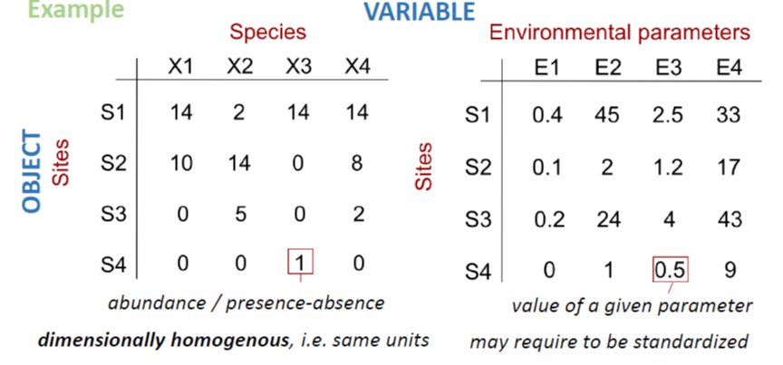

Ecological phenomena are inherently complex, and it is rare that a single variable is sufficient to describe an ecological system, entity, or interaction. Rather, multiple response variables - such as the abundances of multiple species - are often measured to gain ecological insight. In addition, it is common to add multiple explanatory variables to an analysis in an attempt to explain the variation in the response data. Multivariate analyses contend with the complexity of simultaneously analysing **multiple response variables**. 

https://sites.google.com/site/mb3gustame/home/why-multivariate-analysis?authuser=0

{width=100%}

Multivariate data are common in the environmental sciences, occurring when ever we measure several response variables from each replicate sample. Questions like how does the species composition of a community vary across sites, or how does the shape of trees (as measured by several morphological traits) vary with altitude are multivariate questions.

Roughly, five types of scientific inquiries usually suit to the application of multivariate methods.

+ **Sorting and grouping**: many ecological questions are concerned with the similarity or dissimilarity. *Ex:Cluster analysis, non Metric Dimensional Scaling (nMDS)*

+ **Data reduction or structural simplification**: summarize multiple variables through a comparatively smaller set of 'synthetic' variables. *Ex: Principal Component Analysis (PCA)*

+ **Hypothesis testing**: detect and test pattern in the data (be careful of data dredging) . *Ex: MANOVA, PERMANOVA, ANOSIM* 

+ **Investigation of the dependence among variables**: dependence among response variables, among explanatory variables, or among both. *Ex: Redundancy analysis and other constrained analysis* 

+ **Prediction**: once the dependence detected and characterized multivariate models may be constructed in a very similar as we did before with univariate models.

# Data Structure

In ecology, the'typical' dataset used in multivariate analyses will be represented by: 

+ objects in row (e.g. samples can be sites, time periods, etc.)

+ measured variables for those objects in columns (e.g. species, environmental parameters, etc.)

Measured variables can be binary, quantitative, qualitative, rank-ordered, or even a mixture of them. If variables do not have uniform scale (e.g. environmental parameters measured in different units or scales), they usually have to be transformed (see [here](https://sites.google.com/site/mb3gustame/reference/transformations) for more details about it) before performing further analyses.

Many commonly used analyses for multivariate data sets (e.g. PERMANOVA, ANOSIM, CCA, RDA etc.) are “distance-based analyses”. This means the first step of the analysis is to calculate a measure of similarity between each pair of samples, thus converting a multivariate dataset into a univariate one.

There are a couple of problems with these kinds of analysis. First, their statistical power is very low, except for variables with high variance. This means that for variables which are less variable, the analyses are less likely to detect a treatment effect. Second, they do not account for a very important property of multivariate data, which is the mean-variance relationship. Typically, in multivariate datasets like species-abundance data sets, counts for rare species will have many zeros with little variance, and the higher counts for more abundant species will be more variable.

The mvabund approach improves power across a range of species with different variances and includes an assumption of a mean-variance relationship. It does this by fitting a single generalised linear model (GLM) to each response variable with a common set of predictor variables. We can then use resampling to test for significant community level or species level responses to our predictors.

Also, the model-based framework makes it easier to check our assumptions and interpret uncertainty around our findings.

If you’re interested in this method, watch the introductory video, Introducing mvabund and why multivariate statistics in ecology is a bit like Rick Astley…
